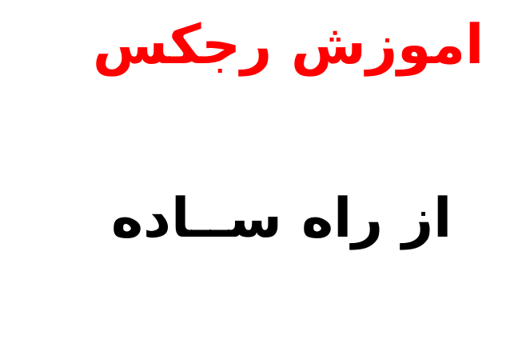
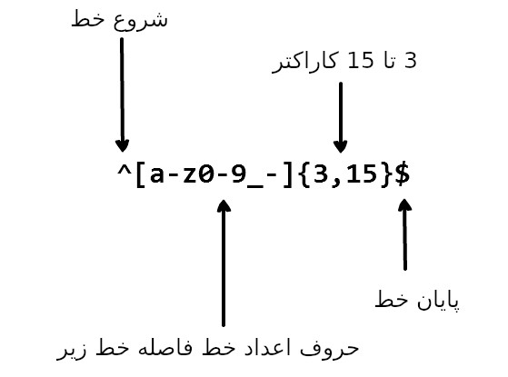

<div dir=rtl>

# به زبان‌های دیگر بخوانید


* [English](README.md)
* [Español](translations/README-es.md)
* [Français](translations/README-fr.md)
* [Português do Brasil](translations/README-pt_BR.md)
* [中文版](translations/README-cn.md)
* [日本語](translations/README-ja.md)
* [한국어](translations/README-ko.md)
* [Turkish](translations/README-tr.md)
* [Greek](translations/README-gr.md)
* [Magyar](translations/README-hu.md)
* [Polish](translations/README-pl.md)
* [Русский](translations/README-ru.md)
* [Tiếng Việt](translations/README-vn.md)


# رجکس چیست؟

> رجکس یا به بیان دیگر عبارت داری نظم، گروهی از حروف و کاراکترها هستند که برای جستجوی الگویی خاصی در متون استفاده می‌شود.

یک عبارت منظم الگویی از رشته‌ها از سمت چپ به راست چیده شده است. عبارت منظم بخاطر تلفظ سخت ان بیشتر از رجکس استفاده می کنند. که معمولا هم از کلمه `regex` در انگلیسی استفاده می‌شود. رجکس در جاگزین کردن متون در دشته‌ها، استخراج الگوهای خاص از متون و فرم‌ها استفاده می‌شود.

یک لحظه تصور کنید که دارید اپلیکشنی می‌نویسید که کاربر می‌خواهد نام کاربری خود را انتخاب کند که داری حروف، کاراکتر و اعداد باشد. همچنین تعداد کاراکترهای کاربر محدود باشد به نظر زیبا باشد. برای این کار کافی است از عبارت زیر استفاده کنید:




رجکس بالا عبارت های مانند `john_doe, jo-hn_doe, john12_` را می‌تواند بگیرد. همچین عبارت مانند `Jo` را نمی‌گیرد اول از همه چون با حروف بزرگ است دومن رشته‌ی بسیار کوتاه است.

# فهرست مطالب


- مشابه‌ها

- متاکاراکتر

- علامت‌نقطه

- مجموعه‌ی از کاراکترها

- نادیده‌گرفتن کاراکترها

- تکرارها

- علامت‌ستاره

- علامت‌پلاس

- علامت‌سوال

- علامت پرانتز

- علامت براکت

- جایگزین‌ها

- محافظ

- لنگرها

- کالسکه

- علامت دلار

- مجموعه‌های دامنه‌ها اختصاری

- جستجوی مثبت منفی

- جستجوی خنثی

- پرچم‌ها

- جستجوی بی‌عیب و نقص

- جستجوی کلی

- جتسجوی چند‌خطه

- خسیس دربرابر تطلبق تنبل

# مشابه‌ها

 در اصل رجکس‌ها مجموعه‌ای از کاراکترهایی هستند که برای جستجو استفاده می شود. برای مثال کلمه `the` از حروف `t`، `h` و `e` تشکیل می شود.

<div dir=ltr>

```
"the" => The fat cat sat on the mat.
s
```

<div dir=rtl>

[رجکس را اجرا کن](https://regex101.com/r/1paXsy/1)


# متاکاراکتر

متاکاراکتر بلوک‌هایی هستند که رجکس را تشکیل می دهند. متاکاراکتر به تنهایی معنایی ندارند. در عوض انان تفسیر می‌شوند تا گروهی خاصی از کاراکترها را بشناسند. برخی از متاکاراکترها دارای نمادی خاصی هستند داخل علامت `[]` نوشته می‌شوند.

انواع متاکارکترها:


|متاکاراکترها|توضیحات|
|:----:|----|
|.|با هر کاراکتری مطابقت دارد به جز خط‌های درهم شکسته.|
|[ ]|تمامی کاراکترها را که در براکت قرار دارد را پیدا می کند.|
|[^ ]|پیدا کردن تمامی کاراکترها به جز این کاراکتر.|
|*|پیدا کردن تعداد تکرار کاراکتر قبلی (تعداد تکرار صفر یا بیشتر).|
|+|پیدا کردن تعداد تکرار کاراکتر قبلی (تعداد تکراریک یا بیشتر).|
|?|پیدا کردن کاراکتر اختیاری.|
|{n,m}|. `n`را پیدا می‌کند اما کمتر از تعداد`m`کاراکتر |
|(xyz)|.گروهی از کاراکترها را به ترتیب پیدا می کند|
|&#124;|پیدا کردن کاراکترهای شبیه به این کاراکترها.|
|&#92;|پیدا کردن کاراکترهای خاص <code>[ ] ( ) { } . * + ? ^ $ \ &#124;</code>|
|^|شروع ورود کاربری.|
|$|پایان ورود کاربری|


# نقطه

نقطه ساده‌ترین متاکاراکتر است. تمامی کاراکترهای جدا را پیدا می‌کند. نقطه خط‌های درهم شکسته را پیدا نمی کند.به عنوان مثال حروف `ar` یعنی هر کاراکتری که بعدش حروف `a` و`r` باشند.

<div dir=ltr>

<pre>
".ar" => The <a href="#learn-regex"><strong>car</strong></a> <a href="#learn-regex"><strong>par</strong></a>ked in the <a href="#learn-regex"><strong>gar</strong></a>age.
</pre>

<div dir=rtl>

[رجکس را اجرا کن](https://regex101.com/r/xc9GkU/1)

# مجموعه‌ کارکترها

مجموعه‌ی از کاراکترها به نام کلاس کاراکترها خوانده می‌شود. برای مشخص کردن کلاسی از کاراکترها باید انان را در داخل  علامت `[]` بگذاریم.
ترتیب کاراکترها در براکت مهم نیست. برای مثال کلمه `Tt]he]` جروف تی‌ بزرگ و تی کوچک بعد ان هم `h` و `e` را به همراه دارد.پس حروف `Tt]he]` را پیدا می‌کند

<div dir=ltr>

<pre>
"[Tt]he" => <a href="#learn-regex"><strong>The</strong></a> car parked in <a href="#learn-regex"><strong>the</strong></a> garage.
</pre>

<div dir=rtl>


[رجکس را اجرا کن](https://regex101.com/r/2ITLQ4/1)

نماد نقطه در در مجموعه از کاراکترها، کاراکتر نقطه را مشخص می‌کند. پس عبارت `[.]ar` بدان معنی است که حروف کوچیک آ را نمایش می‌هد بعد به دنبال ان `r` و پس از ان کاراکتر `.` را نمایش می‌دهد. پس حروف `.ar` را پیدا می کند.


<div dir=ltr>

<pre>
"ar[.]" => A garage is a good place to park a c<a href="#learn-regex"><strong>ar.</strong></a>
</pre>

<div dir=rtl>

[رجکس را اجرا کن](https://regex101.com/r/wL3xtE/1)

> **شاید کمی نامفهوم باشد ولی باکمی بازی با دستورات و اجرا کردن دستورات رجکس پی خواهید برد که چگونه این عبارت‌های منظم کار می‌کند.**

# نادیده‌گرفتن کاراکترها

علامت `^` بدان معنی است که خط شروع شده است. ولی وقتی ان را پس از باز کردن براکت می‌نویسید مفهوم دیگررا می‌رساند. پس تمامی کاراکترهای که در براکت نوشته شده است نادیده گرفته می‌شود.

برای مثال عبارت 

<div dir=ltr>

`[^c]ar`

<div dir=rtl>
بدان معنی است که تمامی کاراکترها را پیداکن به جزء کاراکتر `c`
<div dir=ltr>

<pre>
"[^c]ar" => The car <a href="#learn-regex"><strong>par</strong></a>ked in the <a href="#learn-regex"><strong>gar</strong></a>age.
</pre>


<div dir=rtl>

[رجکس را اجرا کن](https://regex101.com/r/nNNlq3/1)


# تکرارها

علامت‌های `*`، `+` و `?` برای نشان دادن این است که چند بار کلاس‌ها تکرار شوند. این رجکس‌ها بستگی به شرایط ممکن متفاوت عمل کنند.

# علامت ستاره

علامت ستاره نشان تعداد تکرار دفعات است (صفر یا بیشتر). عبارت  `*a` بدان معنی است آ و هر کاراکتری که بود. پس بعد از کاراکتر آ هر کاراکتر ممکن است ظاهر شود.برای مثال : پیدا کردن تعداد تکرار مجموعه‌ی تمامی کاراکترها، باید به این روش عمل کنیم

<div dir=ltr>

`[a-z]*`

تعداد تمامی حروف کوچیک در هر خط
<div dir=rtl>


<div dir=ltr>

<pre>
"[a-z]*" => T<a href="#learn-regex"><strong>he</strong></a> <a href="#learn-regex"><strong>car</strong></a> <a href="#learn-regex"><strong>parked</strong></a> <a href="#learn-regex"><strong>in</strong></a> <a href="#learn-regex"><strong>the</strong></a> <a href="#learn-regex"><strong>garage</strong></a> #21.
</pre>


<div dir=rtl>


[رجکس را اجرا کن](https://regex101.com/r/7m8me5/1)

test

